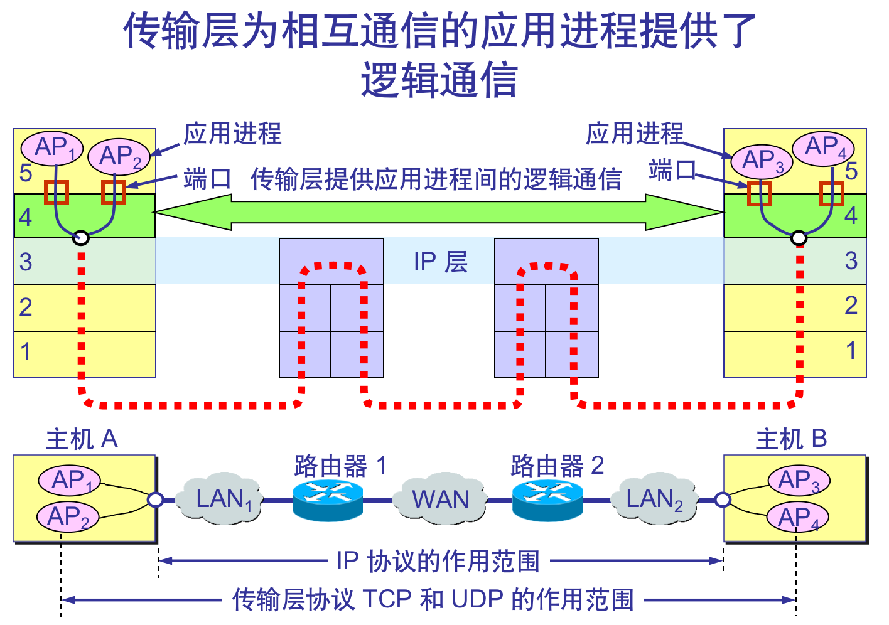
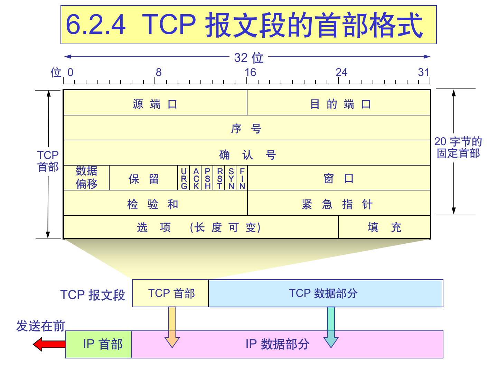

# 一、分布式系统通信基础
|TCP/IP协议栈|
|---|
| 应用层 DNS/OSP/PING/HTTP|
| 传输层 TCP/UDP|
| 网络层 IP/ICMP|
| 数据链路层 ARP/RARP|

<!--more-->

## 1.1 网络层--路由和转发

### 1.1.1 路由算法
* 链路状态算法
    * 每次加入一个机器节点广播自己的连接信息
    * 测量到每个机器的连接时间长度
    * 构建拓扑结构
    * 根据拓扑结构寻找最短路径，如使用Dijkstra算法
* 距离向量算法
    * 构建路由表
    * 计算与相邻机器节点的链接权值
    * 每隔一段时间把自己的路由表发送到相邻机器节点
    * 转发消息时选择与目标机器节点权值最小的那个机器节点

### 1.1.2 IP协议

IPv4版本IP协议头

## 1.2 传输层-面向通信部分最高层

### 1.2.1 数据的可靠传输-TCP/UDP
> TCP(Transmission Control Protocal)协议是一种面向连接的、可靠的、基于字节流的传输层控制协议

>TCP状态转移图

>UDP(User Datagram Protocol)协议是一种不可靠、无连接、基于数据的传输层通信协议

## 1.3 应用层

### 1.3.1 ping
> ping用于测试网络链接。会发送ICMP协议，将请求发送到目的地，并检查对方的ICMP应答，以确定网络联通与否与网络速度。虽然ICMP属于网络层协议，但由于ping使用了ICMP的应用层程序。

### 1.3.2 telnet
> 主要用于Internet上的远程登录。telnet所有数据使用明文传输，因此安全性差，目前基本被SSH取代。

### 1.3.3 OSPF
> OSPF(Open Shortest Path First 开放最短路径优先协议)用于单一自治系统内决策路由，属于链路状态路由协议的一种实现。该协议使用Dijkstra算法计算最短路径树。

### 1.3.4 DNS
> DNS(Domain Name System 域名系统)用于在网站域名和IP地址之间进行映射。DNS运行在UPD协议之上。

### 1.3.5 HTTP
> HTTP(HyperText Transfer Protocol)基于TCP协议，使用客户端和服务器的通信方式。

* HTTP返回码：
    * 1xx 指示信息，表示请求已经接受，急需处理
    * 2xx 成功，表示服务器已经成功接受
    * 3xx 重定向，表示客户端必须根据响应进一步处理
    * 4xx 客户端错误
    * 5xx 服务器错误 

