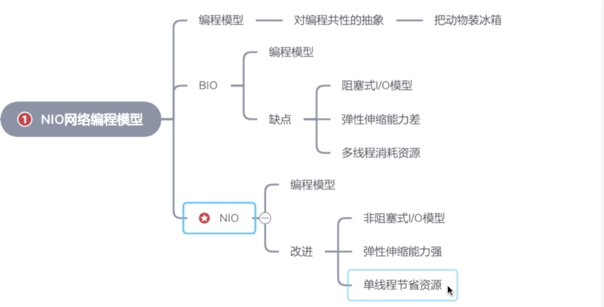
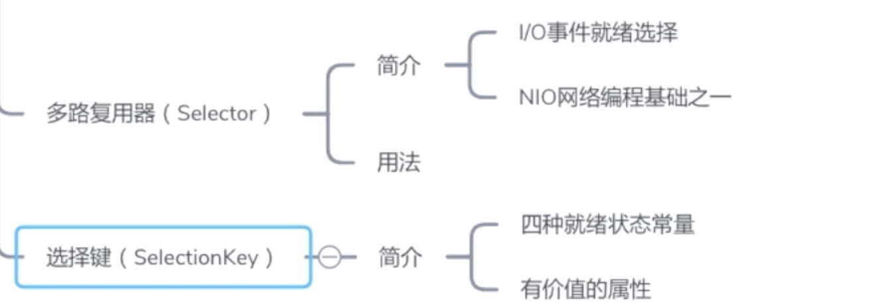
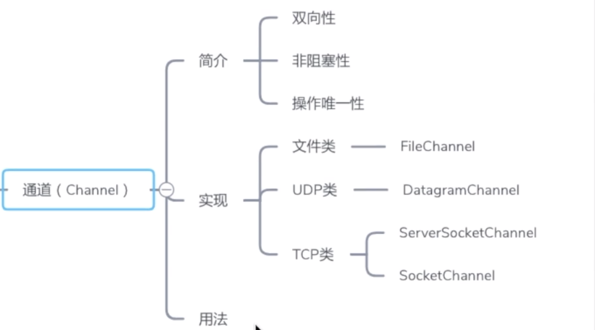
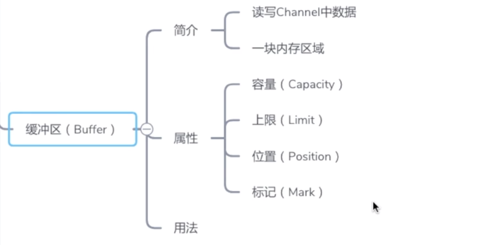
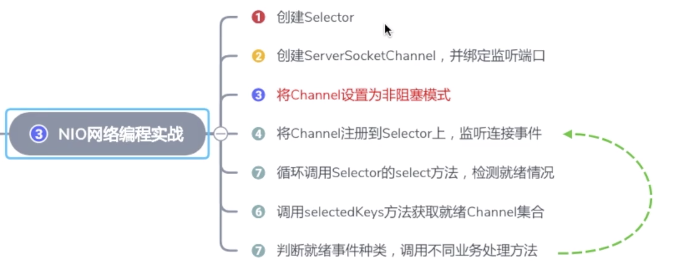

# BIO/NIO简介



<!--more-->

> BIO: 
同步阻塞式IO，在while循环中服务端会调用accept方法等待接收客户端的连接请求，一旦接收到一个连接请求，就可以建立通信套接字在这个通信套接字上进行读写操作，此时不能再接收其他客户端连接请求，只能等待同当前连接的客户端的操作执行完成。 如果BIO要能够同时处理多个客户端请求，就必须使用多线程，即每次accept阻塞等待来自客户端请求，一旦受到连接请求就建立通信套接字同时开启一个新的线程来处理这个套接字的数据读写请求，然后立刻又继续accept等待其他客户端连接请求，即为每一个客户端连接请求都创建一个线程来单独处理。
NIO:
同步非阻塞式IO，关键是采用了事件驱动的思想来实现了一个多路转换器。 
NIO与BIO最大的区别就是只需要开启一个线程就可以处理来自多个客户端的IO事件，NIO运用多路复用器，可以监听来自多个客户端的IO事件： 
> * A. 若服务端监听到客户端连接请求，便为其建立通信套接字(java中就是通道)，然后返回继续监听，若同时有多个客户端连接请求到来也可以全部收到，依次为它们都建立通信套接字。 
> * B. 若服务端监听到来自已经创建了通信套接字的客户端发送来的数据，就会调用对应接口处理接收到的数据，若同时有多个客户端发来数据也可以依次进行处理。 
> * C. 监听多个客户端的连接请求和接收数据请求同时还能监听自己时候有数据要发送。 

## NIO核心部分:
> NIO主要有三大核心部分：Selector, Channel(通道)，Buffer(缓冲区)。传统IO基于字节流和字符流进行操作，而NIO基于Channel和Buffer(缓冲区)进行操作，数据总是从通道读取到缓冲区中，或者从缓冲区写入到通道中。Selector用于监听多个通道的事件（比如：连接打开，数据到达）。因此，单个线程可以监听多个数据通道。

### Selector
> 非阻塞IO的所有操作都是异步的，首先当我们直接调用 serverSocketChannel.accept(); 很可能直接返回一个null，因为客户端没有连接进来。而阻塞IO会一直等到客户端有连接。
再拿服务端读作为例子，当我们直接调用SocketChannel.read()时，可能获取到的就直接是null，而阻塞IO会一直阻塞，直到客户端向服务端发送了数据
这样来看，因为所有请求都是异步，服务端必须要有某种机制，能知道客户端的一些动作。
<strong>而得知这些的方式，就是Selector。通过Selector的select操作，我们能遍历出当前有哪些事件准备好了，比如客户端连接过来了、客户端有数据过来了、可以往客户端发送数据了。</strong>


### Channel


### Buffer


## NIO编程实战-聊天室Demo

```Java
import java.io.IOException;
import java.net.InetSocketAddress;
import java.nio.ByteBuffer;
import java.nio.channels.*;
import java.nio.charset.Charset;
import java.util.Iterator;
import java.util.Set;

/**
 * NIO的服务端
 */
public class NioServer {
    public void start() throws IOException {
        /**
         * 1、创建Selector
         */
        Selector selector = Selector.open();
        /**
         * 2、通过ServerSocketChannel创建channel通道
         */
        ServerSocketChannel serverSocketChannel = ServerSocketChannel.open();
        /**
         * 3、为channel通道绑定监听端口
         */
        serverSocketChannel.bind(new InetSocketAddress(8000));
        /**
         * 4、设置channel为非阻塞模式
         */
        serverSocketChannel.configureBlocking(false);
        /**
         * 5、将channel注册到selector上
         */
        serverSocketChannel.register(selector , SelectionKey.OP_ACCEPT);
        System.out.println("Server start success!");
        /**
         * 6、循环等待新接入的连接
         */
        while(true) {
            /**
             * TODO 获取可用channel数量
             */
            int readychannels = selector.select();
            /**
             * TODO why?
             */
            if (readychannels == 0) continue;
            Set<SelectionKey> selectionKeys = selector.selectedKeys();
            Iterator iterator = selectionKeys.iterator();
            while (iterator.hasNext()) {
                SelectionKey selectionKey = (SelectionKey) iterator.next();
                /**
                 *  移除set中当前的key
                 */
                iterator.remove();
                /**
                 * 7、根据就绪状态调用相应的处理方法
                 */
                /**
                 * 如果是接入事件
                 */
                if (selectionKey.isAcceptable()) {
                    acceptHandler(serverSocketChannel, selector);
                }
                /**
                 * 如果是可读事件
                 */
                if (selectionKey.isReadable()) {
                    readHandler(selectionKey, selector);
                }
            }
        }
    }

    /**
     * 接入事件处理器
     */
    private void acceptHandler(ServerSocketChannel serverSocketChannel, Selector selector) throws IOException {
        /**
         * 如果是接入事件，创建socketchannel
         */
        SocketChannel socketChannel = serverSocketChannel.accept();
        /**
         * 将socketchannel设为非阻塞模式
         */
        socketChannel.configureBlocking(false);
        /**
         * 将channel注册到selector上，监听可读事件
         */
        socketChannel.register(selector , SelectionKey.OP_READ);
        /**
         * 回复客户端提示信息
         */
        socketChannel.write(Charset.forName("UTF-8").
                encode("hello new accept"));
    }

    /**
     * 可读事件处理器
     */
    private void readHandler(SelectionKey selectionKey , Selector selector) throws IOException {
        /**
         * 要从selectionKey中获取已就绪的channel
         */
        SocketChannel socketChannel = (SocketChannel) selectionKey.channel();
        /**
         * 创建buffer
         */
        ByteBuffer byteBuffer = ByteBuffer.allocate(1024);
        /**
         * 循环读区客户端请求信息
         */
        String request = "";
        while(socketChannel.read(byteBuffer) > 0){
            /**
             * 将buffer切换为读模式
             */
            byteBuffer.flip();
            //读取
            request += Charset.forName("UTF-8").decode(byteBuffer);
            /**
             * 再次注册channel
             */
        }
        /**
         *将channel再次注册到selector上，监听他的可读事件
         */
        socketChannel.register(selector , SelectionKey.OP_READ);
        /**
         * 将客户端发送的请求信息广播到其他客户端
         */
        if(request.length() > 0){
            // TODO 广播给其他客户端
            broadCast(selector , socketChannel , request);
        }
    }

    /**
     * 广播给其他客户端
     */
    private void broadCast(Selector selector , SocketChannel socketChannel
                            ,String request){
        /**
         * 获取到已介入所有客户端
         * 循环向所有channel广播信息
         *
         */
        Set<SelectionKey> selectionKeys = selector.keys();
        selectionKeys.forEach(selectionKey -> {
            Channel targetChannel = selectionKey.channel();
            //剔除发消息的客户端
            if(targetChannel instanceof SocketChannel &&
                targetChannel != socketChannel ){
                try {
                    ((SocketChannel) targetChannel).write(Charset.forName("UTF-8").
                            encode(request));
                } catch (IOException e) {
                    e.printStackTrace();
                }
            }
        });

    }
    public static void main(String[] args) throws IOException {
        NioServer nioServer = new NioServer();
        nioServer.start();
    }
}
```
```Java
import java.io.IOException;
import java.net.InetSocketAddress;
import java.nio.channels.SelectionKey;
import java.nio.channels.Selector;
import java.nio.channels.SocketChannel;
import java.nio.charset.Charset;
import java.util.Scanner;

/**
 * Nio客户端
 */
public class NioClient {
    /**
     * 启动客户端
     */
    public void start(String nickName) throws IOException {
        //连接服务器端
        SocketChannel socketChannel = SocketChannel.open(new InetSocketAddress("127.0.0.1" , 8000));
        /**
         * 新开线程，接受服务器端的响应
         */
        Selector selector = Selector.open();
        socketChannel.configureBlocking(false);
        socketChannel.register(selector , SelectionKey.OP_READ);
        new Thread(new NioClientHandler(selector)).start();
        //向服务器端发送数据
        Scanner in = new Scanner(System.in);
        while(in.hasNextLine()){
            String request = in.nextLine();
            if(request != null){
                socketChannel.write(Charset.forName("UTF-8").
                        encode(nickName + " : " + request));
            }
        }
        //接受服务器端相应
    }
    public static void main(String[] args) throws IOException {
        new NioClient().start("Alice");
    }
}

```
```Java
import java.io.IOException;
import java.nio.ByteBuffer;
import java.nio.channels.SelectionKey;
import java.nio.channels.Selector;
import java.nio.channels.SocketChannel;
import java.nio.charset.Charset;
import java.util.Iterator;
import java.util.Set;

/**
 * 客户端线程类，接受客户端响应信息
 *
 */
public class NioClientHandler implements Runnable {
    private Selector selector;
    public NioClientHandler(Selector selector) {
        this.selector = selector;
    }
    @Override
    public void run() {
        try {
            while(true){
                /**
                 * TODO 获取可用channel数量
                 */
                int readychannels = selector.select();
                /**
                 * TODO why?
                 */
                if(readychannels == 0)continue;
                Set<SelectionKey> selectionKeys = selector.selectedKeys();
                Iterator iterator = selectionKeys.iterator();
                while(iterator.hasNext()){
                    SelectionKey selectionKey = (SelectionKey) iterator.next();
                    /**
                     *  移除set中当前的key
                     */
                    iterator.remove();
                    /**
                     * 如果是可读事件
                     */
                    if(selectionKey.isReadable()){
                        readHandler(selectionKey , selector);
                    }
                }
            }
        } catch (IOException e) {
            e.printStackTrace();
        }
    }
    /**
     * 可读事件处理器
     */
    private void readHandler(SelectionKey selectionKey , Selector selector) throws IOException {
        /**
         * 要从selectionKey中获取已就绪的channel
         */
        SocketChannel socketChannel = (SocketChannel) selectionKey.channel();
        /**
         * 创建buffer
         */
        ByteBuffer byteBuffer = ByteBuffer.allocate(1024);
        /**
         * 循环读取服务器端响应程序
         */
        String response = "";
        while(socketChannel.read(byteBuffer) > 0){
            /**
             * 将buffer切换为读模式
             */
            byteBuffer.flip();
            //读取
            response += Charset.forName("UTF-8").decode(byteBuffer);
            /**
             * 再次注册channel
             */
        }
        /**
         *将channel再次注册到selector上，监听他的可读事件
         */
        socketChannel.register(selector , SelectionKey.OP_READ);
        /**
         * 接受客户端的响应信息
         */
        if(response.length() > 0){
            System.out.println("rev : "+ response);
        }
    }
}
```