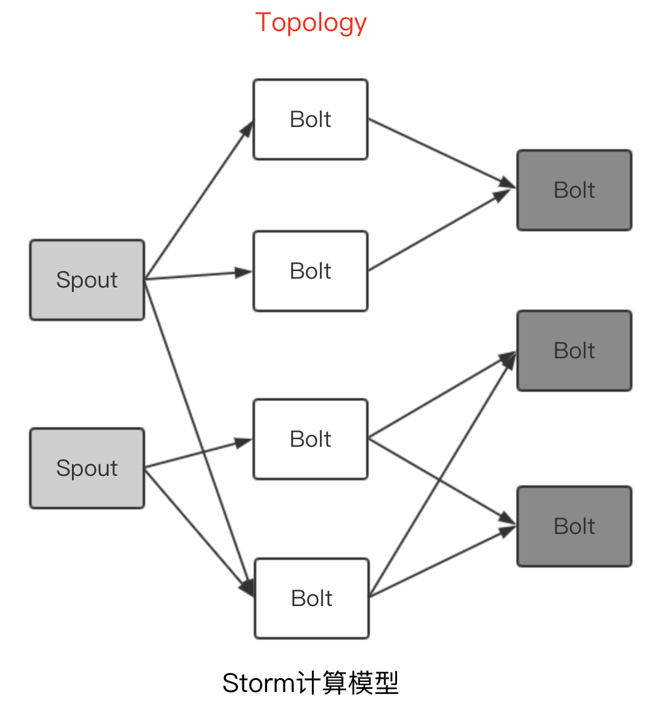
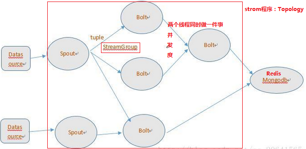

# Storm 实时处理系统
> Storm是一个开源的分布式实时流式计算系统
> 特点
> * 分布式：水平扩展，自动容错 
> * 实时：低延迟(毫秒级) 
> * 流式:数据不间断流入、流出 
> * DAG：Spout Bolt组成DAG计算模型 
> * 易用：像写单机程序一样简单，支持各种语言 
> * Apache顶级开源项目 
> 业务场景： 
> * 实时统计、实时预警 
> * 实时ETL：日志过滤、标注化等 
> * 持续计算-如新闻自动发现分析

<!--more-->

## 编程模型

> * 1.DataSource：外部数据源
> * 2.Topology：Storm中运行的一个实时应用程序的名称，因为各个组件间的消息流动形成逻辑上的一个拓扑结构
> * 3.Spout：在一个Topology中获取源数据流的组件，通常情况下spout会从外部数据源中读取数据，然后转换为Storm内部的源数据。以Tuple为基本的传输单元下发给Bolt,Spout是一个主动的角色，其接口中有个nextTuple()函数，storm框架会不停地调用此函数，用户只要在其中生成源数据即可
> * 4.Bolt：在一个Topology中接收数据然后执行处理的组件,Bolt可以执行过滤、函数操作、合并、写数据库等任何操作。Bolt是一个被动的角色，其接口中有个execute(Tuple input)函数,在接受到消息后会调用此函数，用户可以在其中执行自己想要的操作。
> * 5.Tuple：一次消息传递的基本单元。本来应该是一个key-value的map，但是由于各个组件间传递的tuple的字段名称已经事先定义好，所以tuple中只要按序填入各个value就行了，所以就是一个value list.
> * 6.Stream grouping：即消息的partition方法。Storm中提供若干种实用的grouping方式，包括shuffle, fields hash, all, global,none, direct和localOrShuffle等，Stream Grouping定义了一个流在Bolt任务间该如何被切分。
> * 7.Stream：源源不断传递的tuple就组成了stream。
> Storm提供的6个Stream Grouping类型
> * 1. 随机分组(Shuffle grouping)：随机分发tuple到Bolt的任务，保证每个任务获得相等数量的tuple。
> * 2. 字段分组(Fields grouping)：根据指定字段分割数据流，并分组。例如，根据“user-id”字段，相同“user-id”的元组总是分发到同一个任务，不同“user-id”的元组可能分发到不同的任务。
> * 3. 全部分组(All grouping)：tuple被复制到bolt的所有任务。这种类型需要谨慎使用。
> * 4. 全局分组(Global grouping)：全部流都分配到bolt的同一个任务。明确地说，是分配给ID最小的那个task。
> * 5. 无分组(None grouping)：你不需要关心流是如何分组。目前，无分组等效于随机分组。但最终，Storm将把无分组的Bolts放到Bolts或Spouts订阅它们的同一线程去执行(如果可能)。
> * 6. 直接分组(Direct grouping)：这是一个特别的分组类型。元组生产者决定tuple由哪个元组处理者任务接收。

## 核心组件
* Nimbus：负责资源分配和任务调度。
* Supervisor：负责接受nimbus分配的任务，启动和停止属于自己管理的worker进程。通过配置文件设置当前supervisor上启动多少个worker
* Worker：运行具体处理组件逻辑的进程。一种是Spout任务，一种是Bolt任务。
* Task：worker中每一个spout/bolt的线程称为一个task。同一个spout/bolt的task可能会共享一个物理线程,该线程称为executor｡
