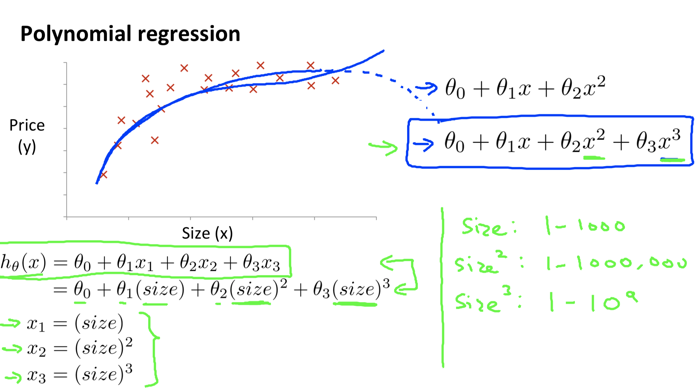
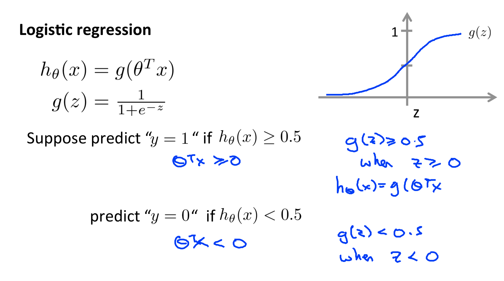

# Chapter 4 Linear Regression with mul2ple variables
## Gradient descent for multiple variables

<!--more-->

## Feature Scaling

## Learning rate

## Features and polynomial regression
> 将高次幂的特征值转换一下，就变成了Linear Regression with multiple variable问题

## Normal equation
<big><big>$$\vec\theta = (X^TX)^{-1}Xy$$</big></big>

# Chapter 5
> 主要是octave的一些数据操作。我用Python代替octave

# Chapter 6 Logistic Regression

## Hypothesis Representation

## Cost function

## Simplified cost function and gradient descent

> Algorithm looks identical to linear regression!

## Multi-class classification: One-vs-all
> 对于每个种类都做一次二分类，本质上还是二分类问题

